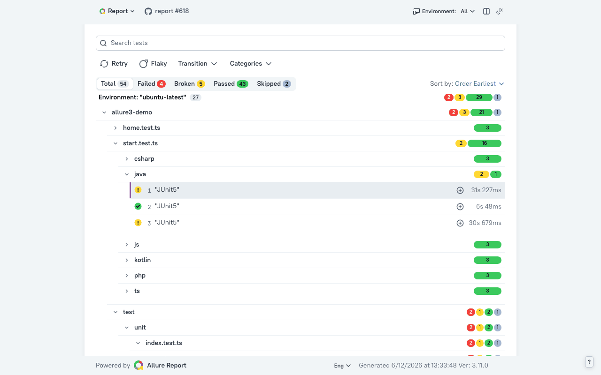

## Allure Framework

### maintained by [Qameta Software](https://qameta.io/?utm_source=github&utm_medium=readme&utm_campaign=header-link)

**Human-friendly test reporting for teams of any size.**

Allure Report is an open-source, framework-agnostic test result visualization tool. It turns raw automated test output into clear, interactive reports that make quality visible across languages, frameworks, CI/CD systems, and teams.

The idea behind Allure is simple: test results should be readable by people, not just CI logs. Developers, QA engineers, managers, and stakeholders should all be able to understand what was tested, what failed, why it failed, and how quality changes over time.

And yes, after years of saying "for humans, not machines", it turns out structured, readable reports are pretty useful for AI agents too ;) Steps, labels, attachments, retries, history, environments, and failure context give agents enough signal to summarize test runs, spot patterns, and help teams act faster.

[Website](https://allurereport.org/) |
[Documentation](https://allurereport.org/docs/) |
[Live demo](https://allure-framework.github.io/allure3-demo/) |
[Questions and Support](https://github.com/orgs/allure-framework/discussions/categories/questions-support) |
[Announcements](https://github.com/orgs/allure-framework/discussions/categories/announcements)

## Ecosystem

Allure is not tied to one language, framework, or CI provider. The ecosystem is built around a shared result format and a set of tools that help teams collect, view, publish, and manage test results.

| Project | Use it for |
| --- | --- |
| [Allure Report 3](https://github.com/allure-framework/allure3) | The next generation of Allure Report, rebuilt for modern quality workflows, dashboards, environments, history, and quality gates. See the [Allure 3 docs](https://allurereport.org/docs/v3/). |
| [Allure Report 2](https://github.com/allure-framework/allure2) | The stable, mature report generator with the broadest integration coverage. See the [Allure 2 docs](https://allurereport.org/docs/v2/). |
| Allure integrations | Official libraries that turn test framework events into Allure result files. Start with the directory below. |
| [Allure TestOps](https://qameta.io/?utm_source=github&utm_medium=readme&utm_campaign=testops-link) | A commercial quality platform for centralized test management, analytics, governance, and collaboration. |

## Integrations

Looking for the right repository? Start with the language-level integration. Framework-specific packages usually live there. The full framework index is available in the [Allure documentation](https://allurereport.org/docs/frameworks/).

### Java, Kotlin, Scala, Groovy, and JVM

Repositories: [allure-java](https://github.com/allure-framework/allure-java), [allure-kotlin](https://github.com/allure-framework/allure-kotlin), [allure-gradle](https://github.com/allure-framework/allure-gradle), [allure-maven](https://github.com/allure-framework/allure-maven)

Test frameworks and runners: [JUnit 4](https://allurereport.org/docs/junit4/), [JUnit 4 AspectJ](https://github.com/allure-framework/allure-java/tree/main/allure-junit4-aspect), [JUnit 5](https://allurereport.org/docs/junit5/), [JUnit Platform](https://github.com/allure-framework/allure-java/tree/main/allure-junit-platform), [TestNG](https://allurereport.org/docs/testng/), [Cucumber-JVM](https://allurereport.org/docs/cucumberjvm/), [JBehave 5](https://allurereport.org/docs/jbehave/), [ScalaTest](https://github.com/allure-framework/allure-java/tree/main/allure-scalatest), [Spock](https://allurereport.org/docs/spock/), [Citrus](https://github.com/allure-framework/allure-java/tree/main/allure-citrus), [Karate](https://github.com/allure-framework/allure-java/tree/main/allure-karate)

Kotlin and Android: [Kotlin JUnit 4](https://github.com/allure-framework/allure-kotlin/tree/master/allure-kotlin-junit4), [AndroidX Test, Robolectric, and instrumentation tests](https://github.com/allure-framework/allure-kotlin/tree/master/allure-kotlin-android)

Browser and UI: [Playwright Java](https://github.com/allure-framework/allure-java/tree/main/allure-playwright), [Selenide](https://github.com/allure-framework/allure-java/tree/main/allure-selenide), [Selenium BiDi](https://github.com/allure-framework/allure-java/tree/main/allure-selenium-bidi)

HTTP, API, and service clients: [REST Assured](https://allurereport.org/docs/restassured/), [Apache HttpClient](https://github.com/allure-framework/allure-java/tree/main/allure-httpclient), [Apache HttpClient 5](https://github.com/allure-framework/allure-java/tree/main/allure-httpclient5), [OkHttp](https://github.com/allure-framework/allure-java/tree/main/allure-okhttp), [OkHttp 3](https://github.com/allure-framework/allure-java/tree/main/allure-okhttp3), [gRPC](https://github.com/allure-framework/allure-java/tree/main/allure-grpc), [JAX-RS](https://github.com/allure-framework/allure-java/tree/main/allure-jax-rs), [Servlet API](https://github.com/allure-framework/allure-java/tree/main/allure-servlet-api), [Spring Web](https://github.com/allure-framework/allure-java/tree/main/allure-spring-web)

Assertions, data, and utilities: [AssertJ](https://github.com/allure-framework/allure-java/tree/main/allure-assertj), [Hamcrest](https://github.com/allure-framework/allure-java/tree/main/allure-hamcrest), [JsonUnit](https://github.com/allure-framework/allure-java/tree/main/allure-jsonunit), [JUnit Jupiter assertions](https://github.com/allure-framework/allure-java/tree/main/allure-jupiter-assert), [Awaitility](https://github.com/allure-framework/allure-java/tree/main/allure-awaitility), [jOOQ](https://github.com/allure-framework/allure-java/tree/main/allure-jooq), [JavaDoc descriptions](https://github.com/allure-framework/allure-java/tree/main/allure-descriptions-javadoc)

### JavaScript and TypeScript

Repositories: [allure-js](https://github.com/allure-framework/allure-js), [allure-npm](https://github.com/allure-framework/allure-npm)

Docs and packages: [Axios](https://allurereport.org/docs/axios/), [AVA](https://github.com/allure-framework/allure-js/tree/main/packages/allure-ava), [Bun](https://allurereport.org/docs/bun/), [Chai](https://allurereport.org/docs/chai/), [CodeceptJS](https://allurereport.org/docs/codeceptjs/), [Cucumber.js](https://allurereport.org/docs/cucumberjs/), [Cypress](https://allurereport.org/docs/cypress/), [Fetch](https://allurereport.org/docs/fetch/), [Jasmine](https://allurereport.org/docs/jasmine/), [Jest](https://allurereport.org/docs/jest/), [Mocha](https://allurereport.org/docs/mocha/), [Newman](https://allurereport.org/docs/newman/), [Node.js test runner](https://github.com/allure-framework/allure-js/tree/main/packages/allure-node-test), [Playwright](https://allurereport.org/docs/playwright/), [TestCafe](https://github.com/allure-framework/allure-js/tree/main/packages/testcafe-reporter-allure-official), [Vitest](https://allurereport.org/docs/vitest/), [WebdriverIO](https://allurereport.org/docs/webdriverio/)

### Python

Repository: [allure-python](https://github.com/allure-framework/allure-python)

Docs: [Behave](https://allurereport.org/docs/behave/), [Pytest](https://allurereport.org/docs/pytest/), [Pytest-BDD](https://allurereport.org/docs/pytestbdd/), [Robot Framework](https://allurereport.org/docs/robotframework/)

### .NET

Repository: [allure-csharp](https://github.com/allure-framework/allure-csharp)

Docs: [NUnit](https://allurereport.org/docs/nunit/), [Reqnroll](https://allurereport.org/docs/reqnroll/), [SpecFlow](https://allurereport.org/docs/specflow/), [xUnit.net](https://allurereport.org/docs/xunit/)

### PHP

Repositories: [allure-php-commons2](https://github.com/allure-framework/allure-php-commons2), [allure-php-api](https://github.com/allure-framework/allure-php-api), [allure-phpunit](https://github.com/allure-framework/allure-phpunit), [allure-codeception](https://github.com/allure-framework/allure-codeception), [allure-behat](https://github.com/allure-framework/allure-behat)

Docs: [Behat](https://allurereport.org/docs/behat/), [Codeception](https://allurereport.org/docs/codeception/), [PHPUnit](https://allurereport.org/docs/phpunit/)

### Ruby

Repository: [allure-ruby](https://github.com/allure-framework/allure-ruby)

Docs: [Cucumber.rb](https://allurereport.org/docs/cucumberrb/), [RSpec](https://allurereport.org/docs/rspec/)

### Apple and Xcode

Docs: [XCResults Reader](https://allurereport.org/docs/guides/xcresults-reader/)

### Go

Repository: [allure-go](https://github.com/allure-framework/allure-go)

Docs: [Repository docs](https://github.com/allure-framework/allure-go)

### Dart and Flutter

Repository: [allure-dart](https://github.com/allure-framework/allure-dart)

Packages: [Dart `package:test`](https://pub.dev/packages/allure_dart_test), [Flutter `flutter_test` and `integration_test`](https://pub.dev/packages/allure_flutter_test), [Dart commons SDK](https://pub.dev/packages/allure_dart_commons)

### Rust

Repository: [allure-rust](https://github.com/allure-framework/allure-rust)

Docs and crates: [Rust Cargo Test](https://allurereport.org/docs/rust/), [Cargo test adapter](https://github.com/allure-framework/allure-rust/tree/main/crates/allure-cargotest), [reqwest integration](https://github.com/allure-framework/allure-rust/tree/main/crates/allure-reqwest), [Rust commons SDK](https://github.com/allure-framework/allure-rust/tree/main/crates/allure-rust-commons), [test macros](https://github.com/allure-framework/allure-rust/tree/main/crates/allure-test-macros)

## CI/CD and Tooling

| Need | Links |
| --- | --- |
| GitHub Actions | [allure-action](https://github.com/allure-framework/allure-action), [setup-allurectl](https://github.com/allure-framework/setup-allurectl), [GitHub Action docs](https://allurereport.org/docs/integrations-github-action/) |
| Azure DevOps | [Azure DevOps docs](https://allurereport.org/docs/integrations-azure/) |
| Jenkins | [Allure Jenkins plugin](https://plugins.jenkins.io/allure-jenkins-plugin/), [Jenkins docs](https://allurereport.org/docs/integrations-jenkins/) |
| Bamboo | [allure-bamboo](https://github.com/allure-framework/allure-bamboo), [Bamboo docs](https://allurereport.org/docs/integrations-bamboo/) |
| TeamCity | [allure-teamcity](https://github.com/allure-framework/allure-teamcity), [TeamCity docs](https://allurereport.org/docs/integrations-teamcity/) |
| IDEs | [JetBrains IDEs](https://allurereport.org/docs/integrations-jetbrains/), [Visual Studio Code](https://allurereport.org/docs/integrations-vscode/) |
| Command line and packaging | [allurectl](https://github.com/allure-framework/allurectl), [allure-npm](https://github.com/allure-framework/allure-npm), [allure-debian](https://github.com/allure-framework/allure-debian) |
| Demos | [Allure 3 demo](https://github.com/allure-framework/allure3-demo), [Allure demo report](https://github.com/allure-framework/allure-demo) |

## Need Centralized Quality Management?

Allure Report is Apache 2.0 open source and works locally, in CI, and in private environments.

When reporting alone is no longer enough, [Allure TestOps](https://qameta.io/?utm_source=github&utm_medium=readme&utm_campaign=testops-section) turns the same Allure ecosystem into centralized, actionable quality management.

It helps teams move from isolated report artifacts to a living quality system with:

- Centralized storage and retention for test reports and quality evidence.
- Long-term launch history, analytics, trends, flaky-test visibility, and environment comparison.
- Actionable failure workflows: reruns, manual result decisions, resolution tracking, and defect creation.
- Unified automated and manual test management, with automated test cases kept in sync from real execution.
- Enterprise controls such as role-based access, team permissions, private projects, 2FA, SAML 2.0, OAuth 2.0, and deployment support.

For security and compliance details, see the [Allure Trust Center](https://trust.allureteam.com/).

## Community

- Ask usage questions in [Questions and Support](https://github.com/orgs/allure-framework/discussions/categories/questions-support).
- Follow project news in [Announcements](https://github.com/orgs/allure-framework/discussions/categories/announcements).
- Share ideas in [General Discussion](https://github.com/orgs/allure-framework/discussions/categories/general-discussion).
- Open issues in the repository that owns the affected package or integration.
- Read the default [contribution guide](../CONTRIBUTING.md) before opening a pull request.
- Report security vulnerabilities privately at security at qameta.io.
